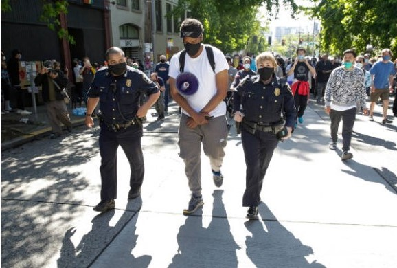

# AI Vision Security Analyzer

AI-powered surveillance analysis tool that evaluates CCTV or street images using Google's Gemini Vision model.

## Features

* AI-based surveillance image analysis
* Threat and crowd behavior detection
* Automated security reports
* Streamlit interactive interface

## Tech Stack

* Python
* Google Gemini Vision API
* Streamlit

## Example Analysis

### Test Image

## Example Surveillance Image



### AI Generated Security Report

```
SECURITY SURVEILLANCE REPORT

Incident ID: 2024-0522-A
Location: Urban thoroughfare, daylight hours
Subject: Public gathering and police escort

People Presence:
Two police officers escorting a central individual while a large crowd follows.

Objects:
Megaphone, backpack, police tactical gear, multiple recording devices.

Suspicious Activity:
Police escort suggests controlled movement of a key subject through a dense crowd.

Security Risk Level:
ELEVATED

Reason:
Large concentrated crowd and police interaction present risk of escalation.
```

## Running the Project

Install dependencies

```
pip install -r requirements.txt
```

Run the application

```
streamlit run app.py
```

## Project Structure

```
ai-vision-security-analyzer
│
├── app.py
├── vision_engine.py
├── samples
│   └── protest_scene.jpg
├── results
│   └── analysis_report.txt
└── README.md
```
